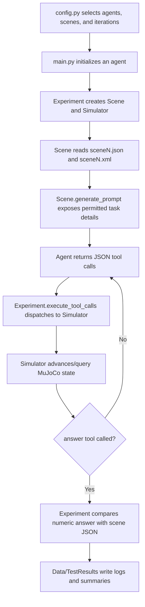

# PhysMent

PhysMent is an interactive physics-reasoning benchmark for evaluating large language models in MuJoCo simulation environments. Each task gives an agent a compact scene description, a paired MuJoCo XML world, and a set of simulator tools. The agent must experiment with the scene and submit a numeric answer.

## Installation

Use Python 3.9 through 3.12.

```bash
git clone <repository-url>
cd PhysMent
python -m venv .venv
.\.venv\Scripts\activate
python -m pip install --upgrade pip
python -m pip install -r requirements.txt
```

Create a `.env` file from the example and add the API keys for the agents you plan to run.

```bash
copy .env.example .env
```

Common keys are:

```dotenv
OPENAI_API_KEY=...
ANTHROPIC_API_KEY=...
TOGETHER_API_KEY=...
GEMINI_API_KEY=...
OPENROUTER_API_KEY=...
```

Set the benchmark range, agents, models, and iteration budgets in `config.py`, then run:

```bash
python main.py
```

For a quick sanity check that all scene answers validate under the local answer checker:

```bash
python local_tools/validate_answers.py
```

## Repository Structure

| Path | Purpose |
| --- | --- |
| `main.py` | CLI entry point. Reads `config.py`, creates agents, runs scenes, and writes logs. |
| `config.py` | Runtime settings for model names, scene range, iteration budgets, timeouts, and active agents. |
| `AgentClass.py` | Adapters for OpenAI, OpenRouter, Anthropic, Gemini, and Together-hosted models. |
| `Experiment.py` | Runs the agent-simulator loop, extracts JSON tool calls, executes tools, and grades answers. |
| `Scene.py` | Loads scene JSON/XML pairs and builds prompts with only the visible, permitted scene attributes. |
| `Simulator.py` | MuJoCo wrapper that exposes physics tools such as stepping, force application, state queries, and answer submission. |
| `Data.py` | Computes per-run metrics and writes structured summaries. |
| `Scenes/SceneN/` | Canonical benchmark scenes. Each folder contains `sceneN.json` and `sceneN.xml`. |
| `TestResults/` | Camera-ready experiment logs, normalized iteration buckets, supplemental runs, and manual grading summaries. |
| `XMLFileCreation/` | Generated XML variants from earlier scene-construction workflows. |
| `OldScenes/` | Archived pre-migration scene material retained for provenance. |
| `local_tools/` | Local maintenance scripts such as answer validation and old-scene migration. This folder is ignored and should not be committed. |

## Scene Format

Each canonical scene has:

| File | Contents |
| --- | --- |
| `sceneN.json` | Metadata, task prompt, numeric answer, object list, and per-object visibility permissions. |
| `sceneN.xml` | MuJoCo world definition used by the simulator. |

Answers are stored as JSON numbers or lists of numbers. Classification and comparison tasks map concepts to numeric codes in the task text, so the final answer remains machine-gradable.

Scene descriptions should reveal enough context for a model to decide what to test, but not enough to bypass experimentation. Physical constants or object attributes are exposed only through the scene permissions and simulator tools.

## Workflow



## Results

The table below reports overall accuracy percentages on PhysMent across iteration budgets, matching the results reported in the paper.

| Iterations | Kimi K2.5 | GLM 5 | DeepSeek R1 | Qwen 3.5 | GPT-5.5 | Gemini 3.1 Pro | Claude Opus 4.7 |
| ---: | ---: | ---: | ---: | ---: | ---: | ---: | ---: |
| 5 | 27.4 | 46.7 | 42.3 | 26.7 | 51.4 | 29.5 | 40.5 |
| 10 | 37.1 | 37.7 | 51.4 | 24.8 | 49.5 | 50.4 | 39.6 |
| 15 | 46.7 | 48.6 | 48.6 | 35.2 | 48.6 | 51.4 | 42.3 |
| 20 | 56.2 | 48.6 | 53.3 | 27.6 | 50.5 | 66.7 | 40.5 |

The machine-readable version is stored at `TestResults/manual_grading_summary.csv`.

`TestResults/` uses a normalized, camera-ready layout. Standard benchmark runs are organized as `iterations_XX/<model>/scene_###/`, where `XX` is `05`, `10`, `15`, or `20`; model folders use lower snake-case names such as `kimi_k2_5`, `glm_5`, `deepseek_r1`, `qwen_3_5`, `gpt_5_5`, and `anthropic_opus_4_7`.

| Path | Contents |
| --- | --- |
| `TestResults/iterations_05/` | Five-iteration benchmark logs by model and canonical scene. |
| `TestResults/iterations_10/` | Ten-iteration benchmark logs by model and canonical scene. |
| `TestResults/iterations_15/` | Fifteen-iteration benchmark logs by model and canonical scene. |
| `TestResults/iterations_20/` | Twenty-iteration benchmark logs by model and canonical scene. |
| `TestResults/unbucketed_runs/` | Imported runs without a reliable iteration-bucket label. |
| `TestResults/legacy_out_of_range/` | Preserved pre-renumbering logs; legacy scene IDs `152-156` correspond to current scenes `102-106`. |
| `TestResults/supplemental_results/` | Supplemental manually provided aggregate logs, renamed by model and iteration budget. |
| `TestResults/manual_grading_summary.csv` | Machine-readable version of the manually verified accuracy table. |

Historical summaries whose `Correct Answer:` field contained labels, formulas, or prose were reconciled against the canonical numeric answers in `Scenes/Scene*/scene*.json`.

Additional result sets imported from the current repository branch include normalized `gpt_5_5`, `anthropic_opus_4_7`, and `supplemental_results` folders. The `gpt_5_5` summaries used the older `1-105` scene numbering, so their answer references were normalized to the current `7-111` canonical scene range.

Because `TestResults/` is ignored by default for local runs, use a forced add when preparing the camera-ready commit:

```bash
git add -f TestResults/iterations_05 TestResults/iterations_10 TestResults/iterations_15 TestResults/iterations_20
git add -f TestResults/unbucketed_runs TestResults/legacy_out_of_range TestResults/supplemental_results
git add -f TestResults/manual_grading_summary.csv
git add -u TestResults README.md
```

## Local-Only Maintenance Scripts

`migrate_old_scenes.py` and `validate_answers.py` are kept in `local_tools/` so they remain available for maintainers without being pushed as part of the camera-ready repository. To make sure they are removed from Git tracking while keeping local copies, run:

```bash
git rm --cached migrate_old_scenes.py validate_answers.py
git add .gitignore README.md
git status --short
```

The `local_tools/` entry in `.gitignore` prevents the moved copies from being added later.

## License

PhysMent is released under the MIT License. See `LICENSE`.

## Citation

```bibtex
@misc{physment2026,
  author       = {Saravalle, S. and PhysMent contributors},
  title        = {PhysMent: An Interactive Physics Reasoning Benchmark},
  year         = {2026},
  howpublished = {\url{https://github.com/<owner>/<repo>}},
  note         = {MIT License}
}
```
